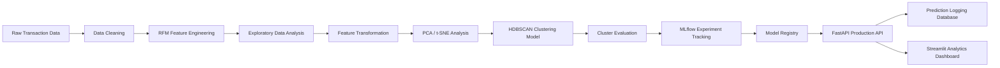
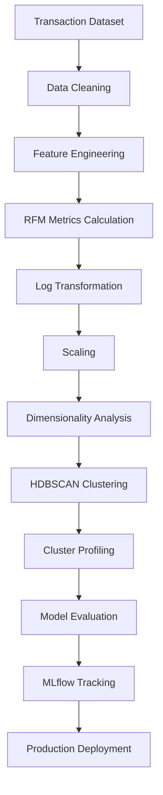
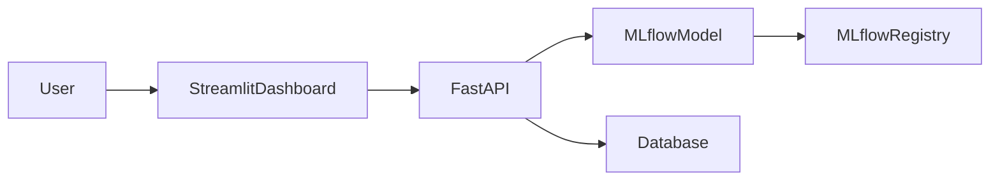

# 📊 Production-Grade Customer Segmentation Platform  
### RFM Analytics + Density-Based HDBSCAN with MLflow-Governed Lifecycle

An end-to-end **Customer Segmentation Platform** designed using **RFM (Recency, Frequency, Monetary) behavioral analytics** combined with **HDBSCAN density-based clustering**.

This project is built with a **Data Scientist / ML Engineer mindset**, focusing on:

- Reproducible pipelines
- Density-aware clustering
- MLflow lifecycle management
- Production deployment with FastAPI
- Interactive analytics dashboard using Streamlit

The platform transforms raw transaction data into **actionable customer segments** that can drive targeted marketing strategies.

---

# 🚀 Project Overview

Customer segmentation is a critical task in **customer analytics and marketing intelligence**.  
Instead of treating all customers equally, businesses need to understand:

- Who their **most valuable customers** are
- Which customers are **about to churn**
- Which segments are **loyal, dormant, or high-value**

This platform analyzes customer purchasing behavior using the **RFM model** and applies **HDBSCAN clustering** to discover **natural behavioral segments**.

The system includes:

✔ Data Cleaning & Transaction Processing  
✔ RFM Feature Engineering  
✔ Behavioral EDA & Visualization  
✔ Density-Based Customer Segmentation (HDBSCAN)  
✔ Cluster Quality Evaluation  
✔ MLflow Experiment Tracking  
✔ Model Registry & Governance  
✔ FastAPI Production API  
✔ Database Logging & Monitoring  
✔ Streamlit Analytics Dashboard  

---

# 🗂 Project Architecture

```
Raw Transaction Data
        ↓
Data Cleaning & Validation
        ↓
RFM Feature Engineering
        ↓
Exploratory Data Analysis
        ↓
Feature Scaling + Log Transformation
        ↓
Dimensionality Analysis (PCA / t-SNE)
        ↓
HDBSCAN Density-Based Clustering
        ↓
Cluster Evaluation (DBCV + Silhouette)
        ↓
MLflow Experiment Tracking
        ↓
Model Registry & Lifecycle Governance
        ↓
FastAPI Segmentation API
        ↓
Database Logging & Monitoring
        ↓
Streamlit Customer Intelligence Dashboard
```

---

# 📦 Dataset

Dataset used: **Online Retail Dataset**

This dataset contains real-world e-commerce transaction data.

Key features:

| Feature | Description |
|------|------|
| InvoiceNo | Transaction identifier |
| StockCode | Product identifier |
| Description | Product name |
| Quantity | Number of purchased units |
| InvoiceDate | Transaction timestamp |
| UnitPrice | Price per item |
| CustomerID | Unique customer identifier |
| Country | Customer location |

---

# 🧹 Data Processing Pipeline

File: `data.py`

### Data Cleaning Steps

- Convert `InvoiceDate` to datetime format
- Remove **cancelled invoices**
- Remove transactions with:
  - Negative quantity
  - Negative price
- Remove duplicates
- Drop missing `CustomerID`
- Convert CustomerID to string identifier

### Feature Engineering

Derived features:

- Year
- Month
- Day
- Day of Week
- Total transaction value

```
TotalSum = Quantity × UnitPrice
```

---

# 📊 RFM Feature Engineering

RFM stands for:

| Metric | Meaning |
|------|------|
| Recency | Days since last purchase |
| Frequency | Number of purchases |
| Monetary | Total money spent |

RFM is calculated per customer using aggregation.

```
Recency = snapshot_date - last_purchase
Frequency = number of invoices
Monetary = total spending
```

A **snapshot date** was defined as:

```
max(transaction_date) + 1 day
```

---

# 📈 Exploratory Data Analysis

File: `eda.py`

EDA focuses on understanding customer behavior patterns.

Key analyses performed:

### RFM Correlation Analysis

Heatmap used to detect relationships between:

- Recency
- Frequency
- Monetary

### High Value Customers

Top spenders identified using:

```
Top 10 customers by Monetary value
```

### Recency Distribution

Analyzed purchase recency behavior across customers.

### Behavioral Clusters Visualization

Used **pairplots** to visually inspect natural groupings.

### Product Insights

Identified **most purchased products among high-value customers**.

### Country Analysis

Average RFM metrics analyzed across top countries.

### Seasonal Activity

Analyzed customer activity across:

- Months
- Days of week

---

# 🔧 Feature Transformation

RFM data initially showed **strong right skewness**:

| Feature | Skew |
|------|------|
| Recency | 1.24 |
| Frequency | 12.06 |
| Monetary | 19.33 |

To stabilize the distributions:

```
Log Transformation
rfm_log = log1p(rfm)
```

After transformation:

| Feature | Skew |
|------|------|
| Recency | -0.37 |
| Frequency | 1.20 |
| Monetary | 0.39 |

This significantly reduced skewness and improved clustering stability.

---

# 📊 Outlier Analysis

Outliers were analyzed using **IQR method**.

Findings:

- Recency: **0% outliers**
- Frequency & Monetary: **< 1.5%**

These were considered **natural behavioral extremes (whales)** rather than data errors.

Therefore **no records were removed**.

---

# 🤖 Customer Segmentation Model

File: `model.py`

### Model Type

**HDBSCAN (Hierarchical Density-Based Spatial Clustering)**

HDBSCAN was selected because:

- Handles clusters of **varying densities**
- Automatically detects **noise / outliers**
- Does not require predefined number of clusters

---

# 🔬 Dimensionality Analysis

Two methods were used to analyze clustering structure.

### PCA

Used for **variance preservation and noise reduction**

```
Explained Variance = 93%
```

This confirms strong relationships among RFM features.

---

### t-SNE

Used to reveal **local density patterns** that PCA might compress.

t-SNE confirmed that clusters depend on **density patterns rather than distance**, validating the choice of HDBSCAN.

---

# ⚙️ HDBSCAN Configuration

Model parameters:

```
min_cluster_size
min_samples
metric (euclidean / manhattan)
cluster_selection_method = "eom"
```

Metric comparison loop was used to determine the best clustering metric.

Evaluation metrics recorded:

- Silhouette Score
- Density-Based Cluster Validation (DBCV)
- Noise percentage
- Cluster stability

---

# 📊 Final Model Performance

| Metric | Score |
|------|------|
| DBCV | 0.0385 |
| Silhouette | 0.0936 |
| Noise Percentage | 8.87% |
| Cluster Stability | 1.33 |

Interpretation:

- Positive **DBCV** indicates valid density clusters
- Low **noise percentage** shows stable segmentation
- Silhouette score confirms meaningful separation

---

# 🧠 Cluster Profiling

Clusters were analyzed using average RFM values.

Segments discovered typically represent:

- New Customers
- Loyal Customers
- Potential Loyalists
- At Risk Customers
- Dormant Customers
- High Value "Whale" Customers

Snake plots were used to visualize cluster behavior across RFM attributes.

---

# 🔁 MLflow Lifecycle Management

File: `mlflow_lifeCycle.py`

MLflow was used to manage the **full model lifecycle**.

Features implemented:

✔ Experiment Tracking  
✔ Parameter Logging  
✔ Metric Logging  
✔ Artifact Logging  
✔ Model Signature Inference  
✔ PyFunc Model Wrapper  
✔ Model Registry  

Registered Model:

```
RFM_Segmentation_Production
```

---

# 🚦 Model Governance

A **Quality Gate** determines if the model is promoted to production.

Criteria:

```
DBCV >= 0.03
Silhouette > 0.01
Noise Percentage < 20%
```

If conditions are satisfied:

```
Staging → Production
```

This ensures only stable clustering models reach production.

---

# 🌐 FastAPI Production API

File: `api.py`

A production-ready **REST API** serves segmentation predictions.

Features:

✔ MLflow model loading  
✔ Batch predictions  
✔ Rate limiting (10 req/min)  
✔ JWT-aware user identification  
✔ SQL database logging  
✔ Latency monitoring  
✔ CRUD endpoints for prediction history  

Endpoints:

| Endpoint | Description |
|------|------|
| POST /predict | Segment customers |
| GET /history | View prediction logs |
| GET /stats | Segment distribution |
| DELETE /history/{id} | Delete log |
| GET / | Health check |

---

# 🗄 Database Logging

Predictions are stored using **SQLAlchemy ORM**.

Logged information:

- Recency
- Frequency
- Monetary
- Cluster label
- Cluster probability
- Whale flag
- Noise flag
- Model version
- Timestamp

---

# 📊 Streamlit Customer Intelligence Dashboard

File: `app.py`

An interactive analytics interface allows users to explore segmentation results.

Features:

✔ Bulk segmentation via CSV upload  
✔ Single customer profiling  
✔ Customer segmentation strategies  
✔ 3D RFM visualization  
✔ Segment distribution analysis  
✔ Prediction history monitoring  

The dashboard provides **business-oriented insights** from the clustering results.

---

# 📦 MLflow Project Configuration

File: `MLproject`

Allows running the entire pipeline with parameter tuning.

Example:

```
mlflow run . -P min_c=100 -P min_s=1 -P m_input=euclidean
```

---

# ⚙️ Environment

Python Version:

```
Python 3.13
```

Main Libraries:

- Pandas
- NumPy
- Scikit-learn
- HDBSCAN
- MLflow
- FastAPI
- Streamlit
- SQLAlchemy
- Matplotlib
- Seaborn

---

# ▶️ How to Run

### 1️⃣ Train Segmentation Model

```
mlflow run .
```

### 2️⃣ Start API Server

```
uvicorn api:app --reload
```

### 3️⃣ Launch Dashboard

```
streamlit run app.py
```
## 🏗 System Architecture


## 🔬 Machine Learning Pipeline


## 🌐 Deployment Architecture


---

# 🎯 Production Highlights

✔ End-to-End Customer Analytics Pipeline  
✔ Behavioral Feature Engineering (RFM)  
✔ Density-Based Customer Segmentation  
✔ MLflow Lifecycle Governance  
✔ Model Registry & Promotion  
✔ FastAPI Production Deployment  
✔ Database Logging  
✔ Interactive Business Dashboard  

---

# 👨‍💻 Author

**Youssef Mahmoud**  
Faculty of Computers & Information  

Aspiring **Data Scientist / ML Engineer**

LinkedIn:  
https://www.linkedin.com/in/youssef-mahmoud-63b243361

⭐ If you find this project useful, consider giving it a star on GitHub.
